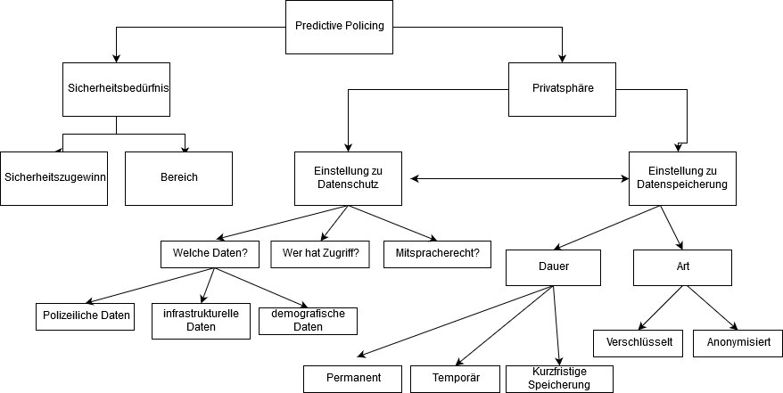

# PredictivePolicing
## In diesem Forschungsprojekt soll die Akzeptanz von Predictive Policing untersucht werden.

# Teammitglieder
## Susanne Gohr, Ines Güldenberg, Alexa Otte, Laura Schröder und Isabelle Wanders

# Forschungsfrage
## _Inwiefern beeinflussen Nutzerfaktoren die Akzeptanz von Predictive Policing in der Bevölkerung?_

# Faktorenraum

## Data Cleaning
29.11.2018: Bereinigung des Datensatzes in R
27.11.2018: Erfassung des Dummy-Datensatzes

## _Frühere Versionen_
Am 29.11.2018 wurde diese Version aus folgenden Gründen angepasst:
- Aktualisierung zur Datensatzbereinigung

Am 06.11.2018 wurde diese Version aus folgenden Gründen angepasst:
- Anpassung der Forschungsfrage
- Anpassung des Faktorenraums