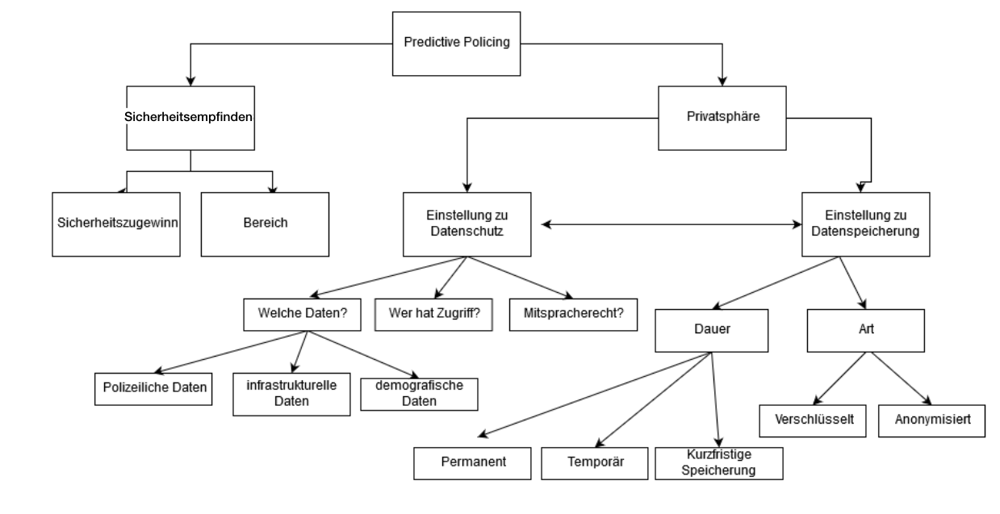

## PredictivePolicing
### In diesem Forschungsprojekt soll die Akzeptanz von Predictive Policing in der Bevölkerung untersucht werden.

## Teammitglieder
### Susanne Gohr, Ines Güldenberg, Alexa Otte, Laura Schröder und Isabelle Wanders

## Forschungsfrage
### _Inwiefern beeinflussen Nutzerfaktoren die Akzeptanz von Predictive Policing in der Bevölkerung?_

## Faktorenraum

## Unterschiedshypothesen
Stand: 08.01.2019

1. Es gibt einen geschlechtspezifischen Unterschied bei der Freigabe von personenbezogenen Daten.

2. Das subjektive Sicherheitsempfinden ist bei kontrolliertem Alterseinfluss abhängig vom Geschlecht.

3. Es gibt einen geschlechtsspezifischen Unterschied hinsichtlich der Einstellung zur Dauer der Datenspeicherung unter dem kontrollierten Einfluss des KUT.

Ergebnisse:
- Bei Hypothese 1 besteht kein statistisch signifikanter Unterschied.
- Bei Hypothese 2 besteht ein signifikanter Einfluss des Geschlechts auf das subjektive Sicherheitsempfinden. Das Alter hat keinen signifikanten Einfluss.
- Bei Hypothese 3 besteht kein statistisch signifikanter Unterschied des Geschlechts und dem Einfluss des KUT auf die Einstellung zur Dauer der Datenspeicherung. 

## Zusammenhangshypothesen
Stand: 19.01.2019

1. Es besteht ein Zusammenhang zwischen der Einstellung zur Privatsphäre und dem subjektiven Sicherheitsempfinden der Probanden.

2. Es besteht ein Zusammenhang zwischen KUT und der Bereitschaft zur langfristigen Datenspeicherung.

3. Es besteht ein Zusammenhang zwischen der Einstellung zur Privatsphäre und der Bereitschaft persönliche Daten preiszugeben.

Ergebnisse:
- Bei Hypothese 1 besteht ein signifikanter schwach positiver Zusammenhang.
- Bei Hypothese 2 besteht kein signifikanter Zusammenhang.
- Bei Hypothese 3 besteht ein signifikanter positiver Zusammenhang.

## Hinweise zum Umgang mit P-Werten

Definition: "Die Wahrscheinlichkeit des beobachteten Ergebnisses, wenn die Nullhypothese stimmt."
- Der P-Wert hilft Ergebnisse von statistischen Tests zu interpretieren.
- Überschreitet der P-Wert 0,05, kann die Nullhypothese nicht verworfen werden (P>5% = H0 beibehalten). Ist P<5%, wird die Nullhypothese zugunsten von H0 verworfen. Insgesamt gilt, je kleiner der P-Wert, desto eher sollte H0 verworfen werden.

- Problem: Häufige Überbewertung des P-Werts
1. Statistisch signifikantes Ergebnis kann irrelevant sein. Es werden Aussagen über die Daten getroffen und nicht über den Wahrheitsgehalt der Hypothesen.
2. Man braucht mehrere Studien um Aussagen zu treffen. Ein signifikanter P-Wert kann als Ausgangspunkt für weitere Forschung dienen. Daher ist es wichtig, den P-Wert zu betrachten.
3. Je größer die  Stichprobe, desto geringer ist der minimale Effekt, der erforderlich ist, um einen statistisch signifikanten P-Wert zu erzeugen. Dies muss bei der Auswertung beachtet werden.

- Quellen: http://www.perfendo.org/docs/BayesProbability/twelvePvaluemisconceptions.pdf
           http://blog.minitab.com/blog/adventures-in-statistics-2/not-all-p-values-are-created-equal
           https://www.youtube.com/watch?v=Gu_PGbINiXw

## Data Cleaning
- 08.01.2019: vollständigen Datensatz (SmartIdentification.cvs) für das Data Cleaning hochgeladen
- 29.11.2018: Bereinigung des Datensatzes in R
- 27.11.2018: Erfassung des Dummy-Datensatzes

## _Frühere Versionen_

Am 19.01.2019 wurde diese Version aus folgenden Gründen angepasst:
- Anpassung Hypothesen, da Dopplung

Am 08.01.2019 wurde diese Version aus folgenden Gründen angepasst:
- Einarbeitung des Feedbacks zu den Hypothesen
- Testung der Hypothesen

Am 20.12.2018 wurde diese Version aus folgenden Gründen angepasst:
- Einarbeitung Feedback zu P-Values
- Einarbeitung Nullhypothesen ins AnalyseScript
- Einarbeitung der Zusammenhangshypothesen

Am 13.12.2018 wurde diese Version aus folgenden Gründen angepasst:
- Testung der Unterschiedshypothesen auf t-Test und ANCOVA

Am 29.11.2018 wurde diese Version aus folgenden Gründen angepasst:
- Aktualisierung zur Datensatzbereinigung
- Einfügen der Unterschiedshypothesen

Am 06.11.2018 wurde diese Version aus folgenden Gründen angepasst:
- Anpassung der Forschungsfrage
- Anpassung des Faktorenraums

